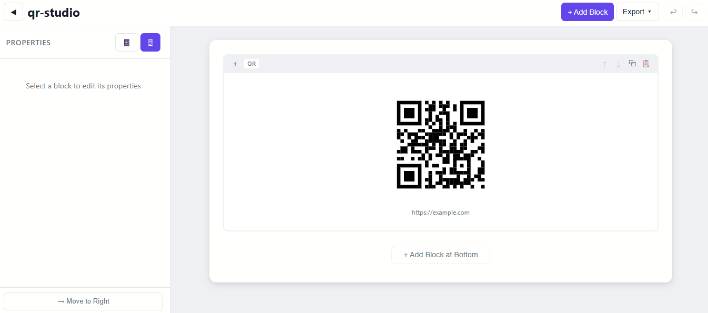

# QR Studio Web

Visual template builder with QR code generation and multi-format export.



## Stack

- **React 19** + **TypeScript 6**
- **Vite 8**
- **Zustand** (state management)
- **Pure CSS** (no UI library)
- **html-to-image** (PNG/JPG/SVG export)
- **jsPDF** (PDF export)
- **Vitest** (testing)
- QR Code generation and rendering based on [Nayuki Project](https://github.com/nayuki/QR-Code-generator)

## Features

- Visual block-based template editor
- QR code generation with configurable style (module shapes, eye styles, colors, logo overlay)
- Block types: QR, Header, Text, Image, Divider, Spacer, Footer
- Undo/redo history
- Dark mode
- Mobile preview
- Persistent state (localStorage)

## Export formats

| Format | Source |
|---|---|
| HTML | Generated from block data (string-based, no DOM dependency) |
| PNG | Captured from `#export-root` DOM element |
| JPG | Captured from `#export-root` DOM element |
| PDF | Captured from `#export-root` DOM element |
| SVG | Captured from `#export-root` DOM element |
| Clipboard PNG | Captured from `#export-root` DOM element |

All image-based exports use the same render source — a hidden `#export-root` element that renders only pure block content without editor UI.

## Export architecture

```
Editor Canvas DOM              Export Preview DOM
┌──────────────────────┐      ┌──────────────────────┐
│ Block controls       │      │                      │
│ Selection borders    │      │   Pure block content  │
│ Move/delete buttons  │      │   (no editor chrome)  │
│ Block content        │      │                      │
└──────────────────────┘      └──────────────────────┘
                                       │
                              html-to-image clone
                              + SVG foreignObject
                                       │
                          ┌────────────┼────────────┐
                          │            │            │
                        PNG          JPG          PDF
                        SVG     Clipboard PNG
```

The `#export-root` element is positioned at `(0, 0)` with `z-index: -1` and `pointer-events: none` — invisible to the user but fully rendered for DOM capture. HTML export bypasses the DOM entirely and generates markup directly from block data.

## Project structure

```
src/
├── components/
│   ├── blocks/          # Block renderers (QR, Text, Image, etc.)
│   ├── canvas/          # Editor canvas
│   ├── export/          # ExportPreview (hidden render source)
│   ├── sidebar/         # Property panels
│   └── topbar/          # Top toolbar with export menu
├── hooks/
│   └── useQr.ts         # QR code generation hooks
├── lib/
│   └── qr/              # QR matrix, renderer, shapes, eyes
├── store/
│   └── editorStore.ts   # Zustand store
├── types/
│   └── template.ts      # Block type definitions
└── utils/
    └── export.ts        # Export functions (toPng, toJpg, etc.)
tests/
├── export-utils.tsx      # Test helpers
├── export-root.spec.ts
├── png-export.spec.ts
├── jpg-export.spec.ts
├── pdf-export.spec.ts
├── svg-export.spec.ts
├── clipboard.spec.ts
└── render-source.spec.ts
```

## Scripts

```bash
npm run dev       # Start dev server
npm run build     # TypeScript check + production build
npm run preview   # Preview production build
npm run test      # Run tests (vitest)
npm run lint      # Run ESLint
```

## Key exports fixed

The export pipeline previously captured the editor canvas container (`.editor-canvas__container`), which included block action bars, selection borders, move/delete buttons, and other editing chrome. All image-based formats (PNG, JPG, PDF, SVG, clipboard) now render from `#export-root`, a dedicated DOM tree containing only pure block content.
